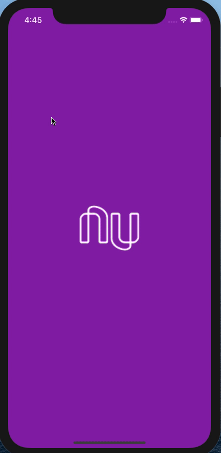

<!-- PROJECT LOGO -->
 

  

  <h3 align="center">UI Clone - Nubank</h3>

<!-- ABOUT THE PROJECT -->

## Sobre o Projeto

Utilizando como base o [vídeo da RocketSeat que ensina animações no React Native](https://www.youtube.com/watch?v=DDm0M_rZLJo), decidi me aprofundar no estudo sobre animações no react native e adicionar algumas animações do app original do nubank.

O resultado foi esse:

 

  

